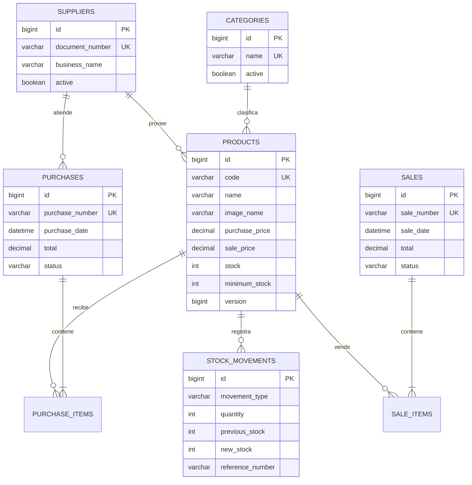

# Arquitectura y modelo - Libreria Vico

## Flujo MVC

```text
Navegador / Thymeleaf
        |
        v
Controller  -> valida entrada HTTP y prepara la vista
        |
        v
Service     -> contrato de la logica de negocio
        |
        v
ServiceImpl -> @Service, reglas de negocio y limites transaccionales
        |
        v
Repository  -> consultas JPA
        |
        v
Entity      -> modelo persistente
        |
        v
MySQL 8 / InnoDB
```

Los controladores nunca utilizan repositorios directamente. Los cambios de stock solo se realizan
en servicios transaccionales y se bloquea el producto durante la operacion para evitar ventas
concurrentes por encima de las existencias.

Los paquetes principales respetan la secuencia indicada en el curso: `entity`, `repository`,
`service`, `service.impl`, `controller` y las vistas Thymeleaf. Los paquetes `dto` y `exception`
complementan esa arquitectura para validar formularios y separar los errores de negocio.

## Modelo de datos



## Reglas principales

1. Una venta no puede dejar un producto con stock negativo.
2. Una compra incrementa stock y actualiza el ultimo costo de compra.
3. Anular una venta restituye todas sus cantidades.
4. Una compra solo se anula si todavia existe stock suficiente para revertirla.
5. Cada cambio de existencias produce un registro inmutable en `stock_movements`.
6. Los productos, categorias y proveedores con historial se desactivan; no se eliminan.
7. Los precios monetarios usan `BigDecimal` y `DECIMAL(12,2)`.
8. Las credenciales se obtienen de variables de entorno y no se versionan.
9. Las imagenes se validan por tipo y tamano, reciben un nombre aleatorio y se guardan fuera del JAR.

## Migraciones

Flyway es el propietario del esquema. `ddl-auto=validate` obliga a Hibernate a comprobar que las
entidades y la base se mantengan alineadas sin modificar tablas silenciosamente.
